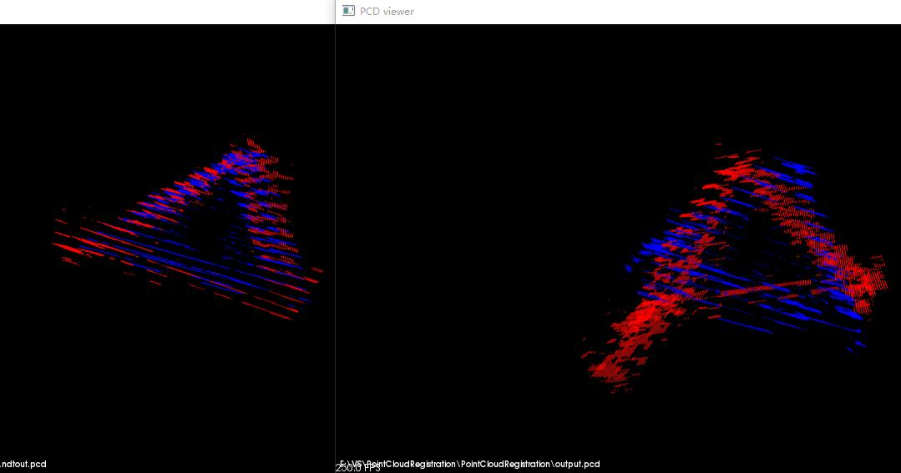

SCA-IA
===
SCA-IA point cloud registration and ICP to solve RT matrix
Developed By VS2013update5 and PCL(Point Cloud Library)

Command Line
---

use program in cmd:

```
    >> PointCloudRegistration.exe source.pcd target.pcd
```

Release Version
---

[__v2.1 SAC-IA + NDT__](https://github.com/P-Chao/SAC-IA/releases/tag/v2.1)

[__v2.0 SAC-IA + ICP__](https://github.com/P-Chao/SAC-IA/releases/tag/v2.0)

[__v1.0 SAC-IA__](https://github.com/P-Chao/SAC-IA/releases/tag/v1.0)

Result View
---

#### NDT or ICP after SAC-IA ####

Right viewer is pointcloud before NDT.



#### Initial Alignment ####

